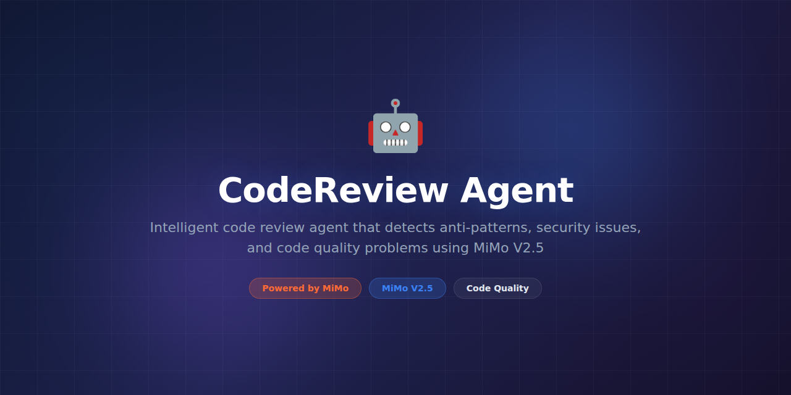

# CodeReview Agent



> **Powered by MiMo** — built on top of Xiaomi's [MiMo](https://platform.xiaomimimo.com) reasoning models for intelligent code review and pattern detection.

[](https://opensource.org/licenses/MIT)
[](https://platform.xiaomimimo.com)
[](https://www.python.org/downloads/)

---

## Why MiMo

Code review is one of the highest-leverage activities in software engineering, yet it's bottlenecked by human availability and cognitive load. Reviewers must understand the change, its context within the codebase, project conventions, and potential downstream effects — all while managing their own workload. Most teams accept lower review quality or slower throughput as a result.

MiMo V2.5 brings strong reasoning capabilities to the review process. It can trace how a change in one module affects others, recognize anti-patterns that deviate from a project's established style, and flag subtle logic errors that pass linters. Its chain-of-thought approach mirrors how a careful human reviewer thinks through code — examining assumptions, testing edge cases, and validating invariants.

Unlike generic LLM-based reviewers that produce vague suggestions, MiMo's structured reasoning produces traceable explanations for every finding. Teams can audit why a suggestion was made, building trust in the system over time. The model also learns project-specific conventions from configuration files, reducing noise and increasing relevance of suggestions.

## Token consumption

| Agent | Model | Tokens/run | Frequency | Daily/user |
|---|---|---|---|---|
| Diff Analyzer | MiMo V2.5 | ~4,800 | Per PR | ~48,000 |
| Pattern Detector | MiMo V2.5 | ~2,600 | Per file | ~26,000 |
| Summary Writer | MiMo V2.5 | ~1,200 | Per PR | ~12,000 |
| **Total** | | **~8,600** | | **~86,000** |

> Estimates assume ~10 PRs/day with an average of 5 changed files per PR.

## What it does

CodeReview Agent hooks into your GitHub workflow to automatically review every pull request. It analyzes diffs for bugs, security issues, style violations, and architectural concerns, then posts inline comments with actionable suggestions and severity ratings. It also generates PR summaries for faster reviewer onboarding.

## Why this exists

Senior engineers spend 15–30% of their time reviewing code. Most reviews focus on style and nits rather than deep logic issues because style is easy to catch and logic is hard. CodeReview Agent handles the routine checks and catches deeper problems, freeing reviewers to focus on architecture and design decisions that truly need human judgment.

## Features

- Automatic PR review via GitHub webhook integration
- Inline code comments with severity levels (Critical / Suggestion / Nit)
- Project-aware context loading from `.coderules` configuration
- Multi-language support (Python, TypeScript, Go, Rust, Java, C#)
- Review history tracking and trend analytics
- Custom rule definitions via YAML
- Configurable noise filtering to reduce false positives
- PR summary generation with change impact analysis
- Security vulnerability detection in diff context
- CI/CD check status integration (pass/fail based on critical findings)

## Tech Stack

- **Runtime:** Python 3.11+
- **AI Engine:** MiMo V2.5 via Xiaomi Platform API
- **Integration:** GitHub API (PyGithub), GitHub Actions
- **Storage:** SQLite (local), PostgreSQL (production)
- **Server:** FastAPI with background workers
- **Analytics:** built-in dashboard with trend charts
- **Infra:** Docker, GitHub Actions

## Quickstart

```bash
# Clone and install
git clone https://github.com/your-org/CodeReview-Agent.git
cd CodeReview-Agent
pip install -e ".[dev]"

# Configure
cp .env.example .env
# Set MIMO_API_KEY and GITHUB_TOKEN in .env

# Review a local diff
python -m codereview diff HEAD~1

# Review with custom rules
python -m codereview diff HEAD~3 --rules .coderules.yaml

# Start the webhook server for GitHub integration
uvicorn codereview.server:app --host 0.0.0.0 --port 8001

# Run via Docker
docker compose up -d
```

## Project Structure

```
CodeReview-Agent/
├── assets/
│   └── banner.png
├── codereview/
│   ├── __init__.py
│   ├── agent.py              # Core review agent orchestrator
│   ├── analyzer.py           # MiMo-powered diff analysis
│   ├── patterns.py           # Pattern detection engine
│   ├── github.py             # GitHub API integration
│   ├── rules.py              # Custom rule engine
│   ├── reporter.py           # Comment formatting & posting
│   ├── summary.py            # PR summary generation
│   └── server.py             # Webhook server
├── tests/
│   ├── test_analyzer.py
│   ├── test_patterns.py
│   └── fixtures/
├── .coderules.example        # Sample project rules
├── docker-compose.yml
├── .env.example
├── Dockerfile
├── pyproject.toml
└── README.md
```

## Contributing

See [CONTRIBUTING.md](CONTRIBUTING.md) for development setup and guidelines. We especially welcome new pattern detectors and language-specific analyzers.

## Configuration

Customize review behavior per project with `.coderules`:

```yaml
# .coderules.yaml
review:
  languages: ["python", "typescript"]
  max_comments_per_pr: 20
  severity_filter: ["critical", "suggestion"]

rules:
  - name: "no-any-type"
    pattern: ": any"
    severity: suggestion
    message: "Avoid 'any' type — use 'unknown' or a specific type"

  - name: "require-error-handling"
    pattern: "async.*\\{"
    severity: critical
    message: "Async functions must have try/catch error handling"

ignore:
  paths: ["tests/", "migrations/", "*.generated.ts"]
```

## License

MIT License — see [LICENSE](LICENSE) for details.

---

*Built with ❤️ using MiMo reasoning models.*
